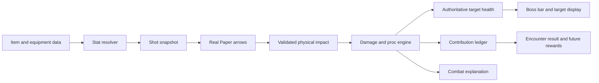

# OnlyDragons: foundation implementation plan

**Design baseline v0.1 — 5 September 2026. Living implementation plan.**

This document describes intended behavior, not proof that a feature exists.
See the [delivery ledger](03-agent-tasks-and-validation.md#current-delivery-status)
for implementation and validation state. Agents update affected design sections
with scoped changes and record material decisions under the
[context update protocol](03-agent-tasks-and-validation.md#shared-context-update-protocol).

The user's next scoped work is [checkpoint 2](07-checkpoint-two.md): dragon health
UI/motion, Tracer volleys, revised Tempo ghost policy, held shortbows and ten-enchant
XP-cost books. Its recorded v2 contracts are planned implementation; preserve the
accepted v1 profiles below. Armor effects and real rewards remain disabled/deferred.

The first playable milestone is a reliable stats-and-bow combat sandbox. A player can equip a test bow, inspect their stats, shoot a target, and see an explanation of critical hits, ferocity, boss-health damage, and contribution. The next milestone adds real dragon tracing and prefire. The eight-eye ritual, complete dragon roster, loot, and progression follow those proofs.

Companion documents: [research and sources](01-research.md), [agent work packages and test gates](03-agent-tasks-and-validation.md). Researched numbers live in the research document; all additional algorithm choices below are proposed OnlyDragons rules.

## 1. Scope and decisions

| Topic | Plan |
| --- | --- |
| Platform | Existing Java 25 / Paper 26.2 build 121 project. Public APIs; no NMS or reflection. |
| Namespace | Every Java package remains under `com.kaveenk.onlydragons`. |
| Strength | Omit from the initial stat set and damage formula. Leave a modifier boundary for a future deliberate addition. |
| Ultimate enchants | **User confirmed: one ultimate per bow.** Duplex and Fatal Tempo use separate bows; swapping is supported. |
| Ghost damage | Separate health and contribution from the beginning. Reduced ferocity health damage is the proposed playtest profile; the preference and exact coefficient remain open. |
| Arrows | Real server entities with continuous identity, including before hatch. No teleporting arrows onto targets or retroactive hit assignment. |
| First enemies | A tagged practice target, followed by a disposable real dragon for collision/prefire verification. |
| Later content | Altar, launch animation, full boss behavior, eyes acquisition, gear economy, enchanting UI, loot tables. |
| Launchers | Testing works with any matching Minecraft Java client. No launcher dependency. |

Use configurable **mechanic profiles**, with an ID and revision recorded in every encounter report. Initially provide an uncapped calibration profile and a dragon profile with the published cap and adjustable ferocity health contribution. Do not build a generic scripting engine or promise exact Hypixel bug compatibility.

## 2. Existing project and what must change

At plan creation, the project had the Gradle wrapper, pinned dependencies, JUnit, MockBukkit, JaCoCo, a real-server lab, Cursor tasks, and a separate legacy-API lab-tools project. Its plugin was the starter command/welcome-message implementation, with no new gameplay systems or their tests. This is the historical starting point; use the delivery ledger and current code for subsequent progress.

Retain the lab and the API-isolation check. Keep `dev/lab-tools` separate: putting its old Spigot API back on the plugin's merged classpath would recreate the editor errors fixed earlier. Game-specific real-Paper tests should compile against the same Paper pin as the plugin in a separate test project, not be forced into that Java 8 compatibility harness.

Add a small, feature-oriented package structure within the existing plugin:

```text
com.kaveenk.onlydragons
  domain.stats          Stat definitions, resolution, snapshots, modifiers
  domain.item           Weapon definitions, enchant sets, item schema
  domain.combat         Damage calculation, hit identity, ledger, proc rules
  domain.enchant        Enchant definitions and bounded effects
  domain.projectile     Shot state, homing math, projectile lifecycle rules
  domain.encounter      Target identity, health, encounter state, results
  application           Combat coordinator, session services, clock/random ports
  paper.item            Item/PDC codecs and equipment adapters
  paper.combat          Paper events, target mapping, native-damage boundary
  paper.projectile      Real Arrow tracking, steering, removal, chunk tickets
  paper.encounter       Dummy/dragon adapters and boss-bar presentation
  command               Player inspection and permission-gated development tools
```

Plain domain code must not import Bukkit/Paper classes. Pass IDs, numbers, vectors, immutable records, and explicit inputs across the boundary. One composition root owns plugin registration and shutdown. Start with ordinary Java classes and interfaces; no dependency-injection framework, database service, or packet library is required.



## 3. Stat system

### Values and units

| Key | Unit | Initial responsibility |
| --- | --- | --- |
| `weapon_damage` | damage points | Comes from the weapon definition. Does not read native arrow damage as the final answer. |
| `crit_chance` | percentage points | Retain the raw value, including values above 100. Ordinary probability is separately bounded to 0–1. |
| `crit_damage` | percent bonus | A critical hit uses `1 + critDamage/100`. |
| `ferocity` | points | Determines extra-hit count. Default effective cap follows the selected mechanic profile. |
| `attack_speed` | percentage bonus | Controls shortbow cadence through a weapon-specific tick formula. |
| `max_health` | health points | Authoritative managed-target health; player health integration is a later task. |
| `defense` | points | Managed-target mitigation. Start with nonnegative values. |

Keep live current health in `TargetState`, not in a cached offensive stat snapshot. Damage bonuses from Snipe/Power/Gravity are named attack modifiers, rather than a different permanent stat for each enchant. Define future health regeneration, movement, magic find, and pet luck only when a feature needs them.

Every stat definition includes a stable key, unit, default, valid range, and aggregation behavior. Reject NaN, infinity, invalid levels, negative damage, and invalid durations at config/item boundaries. Preserve raw values before effective caps where relevant. Never silently turn a malformed item into an overpowered weapon.

### Resolution and provenance

Resolve layers in a documented order:

1. Base profile and weapon values.
2. Flat gear/enchant modifiers.
3. Additive percentage modifiers.
4. Ordered multiplicative modifiers.
5. Effective caps and derived probabilities.

Each modifier has a stable source ID, so refreshing equipment replaces its contribution instead of stacking duplicates. An immutable `StatSnapshot` contains the resolved values, revision, and a small source breakdown for `/onlydragons stats explain`. Changes invalidate a per-player equipment cache; shot acceptance verifies the current equipment fingerprint so an unobserved inventory edit cannot leave stale stats.

Use `double` internally, reject non-finite results, define tolerances in tests, and round only for display. Keep full precision in the ledger. UUID-keyed player session state is released on quit; item properties persist with the item. Session-only development overrides must be clearly identified and must not become permanent progression accidentally.

### T01a calibration and resolver contract

Adopted within GH-3 scope: `StatProfile.calibration()` loads the strict bundled
`stats/calibration-v1.properties` profile (`stats-calibration-v1`). These are
configurable calibration choices, not user-confirmed balance rules:

| Stat | Default | Inclusive raw range | Effective upper cap |
| --- | ---: | ---: | ---: |
| Weapon damage | 0; weapon definition replaces base | 0–1,000,000,000 | 1,000,000,000 |
| Crit chance | 0 | 0–1,000,000 | 1,000,000 |
| Crit damage | 50 | 0–1,000,000 | 1,000,000 |
| Ferocity | 0 | 0–1,000,000 | 500 |
| Attack speed | 0 | 0–1,000,000 | 1,000,000 |
| Max health | 20 | 0–1,000,000,000 | 1,000,000,000 |
| Defense | 0 | 0–1,000,000,000 | 1,000,000,000 |

Zero offensive defaults isolate explicit sources. Crit damage 50 supports the
existing 1.5× calibration fixture; health 20 is a small test baseline, without
player-health integration. Ferocity 500 follows the researched cap. Other high
finite bounds are input guardrails with room for boss health and future tuning;
attack speed has no invented 100-point cap. Ordinary probability remains
`min(1, effectiveCritChance / 100)`, while raw crit chance is retained. No Strength
or Overload formula is introduced.

`StatResolver(profile).resolve(revision, baseOverrides, sources)` returns an
`ExplainedStatSnapshot`, wrapping the complete stable T00 `StatSnapshot`, profile
revision, and immutable per-stat base and arithmetic steps. Bases and final raw
values must satisfy the profile range. Flat amounts are summed before adding to
the base; percentage points are summed before multiplying by `1 + sum / 100`.
Every arithmetic operation must remain finite; overflow fails even if a later
zero multiplier or cap would hide it. Negative post-flat values and negative
additive factors fail; no silent floor or sign reversal is allowed. Negative flat
and percentage contributions are permitted when these resulting layers stay
nonnegative. Effective caps are applied last and never rewrite raw values.

All layers follow T00 `StatModifier.EXPLANATION_ORDER`: within stat/operation,
ascending numeric order, then case-sensitive source ID, then amount. This also
fixes floating-point summation and multiplier ties independently of input order;
identical repeated modifiers remain repeated contributions. Explanations record
the aggregate flat/percentage operands, each ordered factor, cap and results,
with each step's source modifiers copied.

`ModifierSources.empty().replace(sourceId, contributions)` returns a new value,
replacing that source's entire collection; empty means removal. Every contribution
must match the supplied source ID. `StatSnapshotFactory(profile).create(revision,
weapon, additionalSources)` supplies `WeaponDefinition.baseDamage` as the weapon
base exactly once and applies its modifiers afterward. Additional source IDs must
be disjoint from weapon source IDs or creation fails. T01b owns equipment source
naming, refresh, and snapshot revision allocation; callers must distinguish
revisions when inputs change. Profile candidates validate all seven definitions,
caps, identity/version and supported policies before returning; unknown, duplicate,
missing or invalid properties fail. Existing resolvers/snapshots retain their old
immutable profile. Runtime adoption/reload belongs to later integration.

The lead's GH-3/GH-4 integration audit fixes ordinary calibration crit damage
at 50 total: bows must not add a redundant flat 50. T02's requested
`ResolvedItem.resolvedWeapon()` projection carries the validated base damage,
complete definition/enchant/roll modifier list and enchantments. T01b passes that
projection once to `StatSnapshotFactory`, with only external sources separately.
The factory regression fixture resolves a bare 100-damage bow to damage 100,
crit damage 50, crit chance 0 and ferocity 0. A projected fixture adding crit
chance 100, ferocity 25 and rolled damage 2.5 resolves to 102.5 / 50 / 100 / 25,
with ordinary probability 1 and exactly three contributions. Those roll/enchant
amounts remain numeric boundary fixtures. T02's projection and all eight preset
totals were verified after integration in item-codec-v4 (PR #24) and T01b
equipment checks (PR #29/#32); see the [T02 evidence](03-agent-tasks-and-validation.md#t02-item-validation-evidence)
and [T01b evidence](03-agent-tasks-and-validation.md#t01b-equipment-validation-gh-7).

### T01b equipment and inspection boundary (GH-7)

Adopted within task scope: `EquipmentStatsService` owns UUID-keyed session
inspections and session-only flat development bonuses on the classic Paper
server thread. Each refresh decodes both hands through the production codec.
Its value fingerprint includes full validated instances (UUID, revisions,
enchants and named rolls), resolved catalog data, immutable profile, and external
source contents. Only the active main-hand `resolvedWeapon()` is passed once to
the factory. Offhand identity is inspectable but supplies no weapon modifiers;
unmanaged or invalid main-hand items use profile defaults, including zero weapon
damage before external bonuses. Invalid metadata is identified in the explanation.

Unchanged fingerprints reuse the immutable inspection; changed inputs allocate a
new session-independent revision. Accepted snapshots remain immutable. Inventory
slot, held-slot, hand-swap, join and respawn events coalesce into one next-tick
refresh per player. Quit/death cancel queued refreshes and clear cached state and
bonuses; disable cancels all owned callbacks and clears sessions. Every inspection
also revalidates live item contents, including edits that preserve UUID. This is
an integration entry point for T06, **not shot-time firing integration**.

`stats [explain]` requires `onlydragons.stats` (default true). `dev loadout <id>`,
`dev bonus <stat> <nonnegative amount>`, and `dev clear` require
`onlydragons.calibration` (default op) and act only on the caller. Grants use
registry creation and the production codec, occupy an empty storage slot, and
never replace existing equipment or drop overflow. Bonuses replace one flat
`dev:bonus:<stat>` source and validate the entire candidate before adoption.
Zero removes a source. If a later equipment change makes existing bonuses exceed
profile ranges, bonuses clear atomically and inspection explains the reset.
These are development additions, not progression, live player attributes or
Fatal Tempo mechanics. Status/reload and the alias remain; reload changes greeting
configuration only, with compiled catalogs requiring restart. See the
[short Cursor Play procedure](../../dev/stats-play.md) and T01b evidence ledger.

### Initial test loadouts

Provide deterministic calibration presets: normal damage with 0 ferocity; guaranteed crit; 25 ferocity; 100 ferocity; capped ferocity; a Tracer bow; a Duplex bow; and a Fatal Tempo bow with a nonzero base ferocity source. Each preset should state the stats it supplies. These are development gear grants, not the final acquisition loop.

## 4. Item and enchant representation

An item definition separates identity, presentation, weapon behavior, stats, and enchants:

```text
WeaponDefinition
  definitionId, schemaVersion, definitionRevision
  displayName, material, firingMode
  baseDamage, launchSpeed, drawPolicy, cooldownPolicy, primaryArrowCount
  statModifiers, enchantments

ItemInstance
  instanceId, definitionId, schemaVersion, rolledModifiers, enchantments
```

Use `onlydragons:` PDC keys for persistent item identity and validated levels. Lore, glint, and display text reflect that data; renaming an ordinary bow must never grant an enchant. Do not store Bukkit entity references in item data. Reject multiple ultimate enchants at every grant/load/edit boundary, including malformed administrative input.

An `EnchantDefinition` declares its ID, legal levels, item compatibility, ultimate category, conflicts, and effect hooks. The first hooks are stat contribution, shot emission, impact modification, and post-hit state update. Effects return data/commands rather than registering their own competing damage listeners.

Initially, enchant application uses permission-gated development commands. Native enchanting-table generation, anvils, books, resource packs, and registry-backed client presentation are separate later features. PDC-based behavior avoids tying the combat engine to an experimental registration lifecycle. [Paper PDC background](https://docs.papermc.io/paper/dev/pdc/)

### T02 adopted item boundary (GH-4)

The additive implementation wraps the stable T00 `WeaponDefinition` in
`ItemDefinition` for name/material/allowed rolls. `ItemInstance` carries its
`WeaponIdentity`, registry revision, enchant ID/level selections and named roll
IDs. `ItemRegistry.resolve` returns immutable trusted definition, enchant and
modifier data for later equipment/snapshot consumers. Its `resolvedWeapon()`
projection supplies the complete validated modifier/enchant lists on a T00
weapon definition. #7 passes this projection once to T01
`StatSnapshotFactory.create`, with only external gear/buffs in additionalSources;
passing resolved item modifiers again would collide or double-count. It never adds
`WeaponDefinition.baseDamage` again as a flat modifier. Create allocates a fresh
UUID; edit replaces selections while retaining identity and validates both
the original and replacement. Defaults apply on creation, not again on load.

Schema v1 owns a nested `onlydragons:weapon` PDC container. Both schema and
catalog/definition revisions must match exactly. Prior schema 0, future schema
2 and changed revisions explicitly reject; no released legacy format exists
to justify automatic migration. Unknown fields/IDs/types/levels, extra
ultimates, raw stats, invalid UUIDs, wrong material and stack amounts other
than one fail with a typed reason. Other plugins' outer PDC keys are ignored.
The immutable trusted registry determines enchant kinds and finite modifier
bundles; PDC cannot self-classify an ultimate or supply raw roll amounts.
Per-definition allowlists gate named rolls; duplicate selections reject.
This is a plugin data boundary, not a signature against privileged PDC writers
or an anti-duplication ledger for cloned item UUIDs.

`CalibrationLoadouts.registry()` supplies compiled `calibration-items-v2`
development data to the production equipment service and permission-gated
calibration commands. T01b wired it through `OnlyDragonsPlugin`; changes require
a restart because the registry is not reloadable configuration. All eight
drawn bows supply base damage 100 and no crit-damage modifier. The lead
confirmed T01 owns baseline crit damage 50; the initial item +50 was removed
before handoff to avoid resolving 100. With T01
base crit chance/ferocity 0, expected damage/crit damage totals are 100/50 for
all presets, with crit chance/ferocity as specified below. Ordinary supplies
zero crit/ferocity, crit supplies +100 crit chance, and the ferocity presets
supply +25/+100/+500 ferocity. Tracer and Duplex use level V with zero
ferocity; Fatal Tempo V has +25 ferocity. Effective values/caps depend on T01's
base profile; these are explicit calibration contributions, not a second stat
resolver or final balance. Vicious I–V contributes +1 ferocity per level as an
adopted calibration choice. Power I–VII, Snipe I–IV and Tracer/Duplex/Tempo I–V
remain validated identifiers for later effect consumers; no effect engine is
introduced. Overload and Gravity/Dragon Hunter remain unsupported pending
their unresolved profile decisions. All current enchants accept drawn and
shortbows, with no conflict beyond the user-confirmed single ultimate.

Display name/lore/glint are generated output, independent of decoding; no
native damage enchants are applied. Encoding makes a new stack and does not
promise to preserve foreign metadata or durability during an item edit.
Both codec entry points require the classic Paper server thread; no session,
async callback or task is introduced. See [item catalog/schema](../../src/main/resources/items/README.md)
and [enchant catalog](../../src/main/resources/enchants/README.md) for consumer
instructions. Authenticated inventory/rename/visual checks remain separate
from the synthetic real-Paper round-trip scenario.

## 5. Shot ownership, snapshots, and swapping

Each accepted trigger receives a `shotId`. Every real arrow has its own projectile UUID and ordinal; a Duplex child also references its parent. Record owner UUID, weapon instance/definition, immutable gear stats, enchant levels, mechanic revision, launch tick, launch position, and initial velocity.

**Proposed timing contract:**

- Weapon, gear, enchants, and crit inputs are captured when the shot is accepted. Swapping after release cannot turn a Duplex arrow into a Fatal Tempo arrow.
- Roll crit from an injected random source at shot creation. A Duplex child inherits the primary offensive roll and has its own damage scale. Different primary arrows may receive distinct rolls if a later multi-arrow weapon specifies that policy.
- Temporary Fatal Tempo state is evaluated at impact and frozen for that impact's extra-hit calculation. Base ferocity still comes from the shot snapshot. This permits deliberate tempo building and subsequent bow swapping while keeping item ownership traceable.
- Only a captured Fatal Tempo source, or its explicitly eligible descendants, can add/refresh tempo. A Duplex impact may benefit from an existing buff without refreshing it merely because the player now holds another weapon.
- Snipe initially uses launch-position-to-impact displacement, continuously scaled per ten blocks. Record traveled path length too, but do not use it to reward homing loops. This is a deliberate simplification of the reported Hypixel player-at-impact distance behavior.

Tests must cover shots fired before a buff, after a buff, during expiry, and after a swap. The trace must include both launch snapshot revision and impact-time buff state, so the hybrid timing rule is observable.

## 6. One combat authority

Only managed weapons hitting registered OnlyDragons targets enter this pipeline. Ordinary combat elsewhere retains its existing behavior. In the dedicated arena, non-managed damage to the managed boss is rejected with a reason; a basic vanilla-looking test bow can be explicitly registered as a loadout.

Process an impact on the server thread:

1. Resolve a dragon part to its parent target and encounter ID.
2. Validate physical impact, owner, target liveness, arena, and event cancellation.
3. Claim an idempotency key `(encounterId, projectileUuid, targetId, impactOrdinal)`.
4. Calculate offensive damage, including the captured critical roll and named bonuses.
5. Apply target mitigation, then the selected per-hit cap.
6. Apply the health/contribution policy and clamp actual HP loss to remaining HP.
7. Commit the health update and ledger entry once.
8. Determine bounded ferocity children from the pre-update buff snapshot; update eligible tempo state; schedule children.
9. Publish immutable results for UI, traces, and future rewards.

`ProjectileHitEvent` and `EntityDamageByEntityEvent` must not both call the engine independently. The T04 findings below identify a physical-impact source and measured event ordering, with player-owned native controls now measured in the companion. Track collision candidates and finalize only after relevant cancellation has settled. Centralize native damage suppression and managed damage application in one adapter; do not award managed damage from an event cancelled by another component. [Projectile event semantics](https://jd.papermc.io/paper/26.2/org/bukkit/event/entity/ProjectileHitEvent.html)

**T04 scoped refinement (Paper 121):** use `ProjectileHitEvent` as the sole
physical-impact candidate source. Real shooterless dragon collisions can omit the
damage event entirely, so that event is an optional native-damage/cancellation
guard, not an impact prerequisite. Reserve one terminal claim at the first
managed collision, then settle after synchronous handlers finish and honor the
final externally cancelled `ProjectileHitEvent`. Do not cancel that event for
owned native suppression. Retire the projectile on acceptance or rejection,
including veto and unsupported phase; later multipart callbacks cannot create
another claim or impact ordinal. Preserve any native cancellation observed before
owned suppression as an additional veto. A single cancellation boolean cannot
reveal arbitrary later setter provenance once our guard sets it; integrations
requiring a guaranteed veto must use the physical-hit boundary. This explicit
lead clarification replaces the earlier unsupported later-native-veto promise.
Recheck encounter generation and target liveness before committing the claim.
Zero native arrow damage/critical randomness before managed flight;
centralize residual native managed-target damage suppression. The player-owned
continuation supports this path on Paper 121: native positive
controls lose HP, while hit cancellation, damage cancellation and zero native
base damage prevent that loss. Zero damage and seated hits can omit damage
events and leave rebounding arrows; terminal retirement must be explicit.
Three simultaneous player-owned collisions emit only one native damage event,
so native hurt-window behavior must not discard physical candidates. External
integrations need the hit path for vetoes when native damage events are absent.
Actual 1×1×1 versus 5×3×5 geometry lost 4 versus 2 HP; this does not establish a
robust semantic selector.

**Reviewed OnlyDragons calibration policy (GH-5 / PR #31):** every managed
dragon part uses scale **1.0**, with parent identity from the actual impacted
part. No semantic head identifier or Hypixel parity is claimed. Initially
admit actual part impacts only during the measured `HOVER`, `CIRCLING`, and
`SEARCH_FOR_BREATH_ATTACK_TARGET` phases, including managed hits in that
measured seated phase despite native arrow immunity. Reject every other phase
with an explicit unsupported-phase reason until measured. Natural End cycles
and all-phase coverage remain pending automation.

`ProjectileHitEvent` supplies the physical candidate. The production adapter
must make one idempotent claim and explicitly retire terminal projectiles;
zero-damage rebounds and cancelled hits can retain live arrows. Zero native
base damage and critical randomness before flight, then suppress residual
native damage. Keep external vetoes distinguishable from this owned suppression.
Do not require a native damage event: zero-damage/seated impacts and simultaneous
physical hits can omit it. [Player-owned evidence](../../dev/game-tests/findings/projectile-player-feasibility.md)
records the positive controls and limits. These scoped decisions revise the
unsupported semantic/phase assumptions; production end-to-end claim, veto,
retirement and phase-rejection tests are separately accepted under T06 in
PR #52 at `25891c0`; [T06 evidence](evidence/t06-suite.md).
T04 is accepted and merged at `705de34`; [final evidence and separate policy review](evidence/t04-suite.md) record the decision. Bounded M0 contracts/feasibility retains its acceptance through the [combined cohort and separate policy review](evidence/catalog-procs-suite.md); T08 accounting is separately accepted through [PR #57 evidence](evidence/t08-suite.md); M1–M5 remain unaccepted.
No production adapter is introduced by the feasibility scenario.

A proposed simple damage model is:

```text
offense = weaponDamage * drawScale * projectileScale
          * (1 + sum(additiveDamageBonuses))
          * product(separateMultipliers)
          * criticalMultiplier

mitigated = offense * 100 / (100 + targetDefense)
capped = capPolicy(mitigated, targetMaxHealth)
```

All percentage bonuses are converted to fractions once. Full draw has a scale of 1; the exact partial-draw curve is a weapon policy validated during the bow spike. Shortbows have their own accepted-trigger behavior. Do not apply native critical randomness, native Power, velocity-derived arrow damage, and the custom formula simultaneously. The published damage cap, when enabled, is per physical/proc hit rather than per entire volley. See [cap research](01-research.md#published-boss-cap).

For an uncapped target with zero defense, a 100-damage weapon, a 40% additive bonus, and a critical multiplier of 1.5 yields 210 damage. This is a **test fixture for our model**, not a claim that these numbers reproduce an entire SkyBlock loadout.

### T03 combat service contract

Adopted within GH-6 scope, preserving all T00 records: `CombatProfile` freezes
`MechanicRevision`, mitigation (`NONE` or `NONNEGATIVE_DEFENSE`), cap (`NONE` or
`HISTORICAL_2021`), and a ferocity health fraction in [0, 1]. `calibration()` is
uncapped with ordinary defense and full health/score; `dragonExperiment(...)`
requires an explicitly named revision and experimental coefficient. There is no
chosen production reduced-health default. Callers must change the revision when
changing profile values and retain that immutable profile for the encounter.

`DamageModifiers` accepts named nonnegative additive **fractions** (0.4 = +40%)
and nonnegative separate factors, with deterministic source-ID ordering and
immutable copies. Zero factors support complete reduction; negative additive
bonuses are not part of this version. `CritResolver.roll(snapshot, random)`
consumes one validated [0, 1) draw and uses a strict probability threshold,
including probabilities 0 and 1. `DamageCalculator` uses captured effective
weapon damage and crit damage (T01 baseline 50), draw/projectile scales, named
bonuses, mitigation, then the cap. Every intermediate overflow fails.

`CombatEncounter(target, variantId, profile)` starts a single target at full
positive HP. Construct and access it on the server thread; it enforces its
creating-thread ownership without importing Bukkit. `physical(shot, impact,
modifiers, effectiveFerocity, adapterRejection)` consumes an already settled
physical candidate. The adapter owns collision proof, arena/event cancellation,
and native suppression. A supplied rejection earns nothing. Accepted physical
keys are claimed once; IDs are deterministic from the full T00 key, independent
of part/event names. Same-tick calls commit in server-thread call order.

`proc(command, tick)` requires a due command with an accepted non-ferocity parent
and matching origin, owner, shot, profile, crit and **mitigated pre-cap** basis.
It never rerolls crit, redoes mitigation or uses a newly held weapon. Duplex
parents retain their own scaled basis. Each child applies the cap once. T05 owns
child count/IDs and scheduling; this service does not authorize an arbitrary
number of children. No proc can become another proc's parent. Malformed,
premature or mismatched-profile inputs throw before mutation; lifecycle and
duplicate rejections return a zero-credit `DamageResult` with a reason.

Accepted hits update per-UUID actual HP and capped contribution independently;
lethal score is not clamped to remaining HP. Score-only children request zero HP.
All numeric validation, including cumulative score overflow, precedes commit.
One lethal commit freezes an `EncounterResult` (completion ID = lethal impact
ID); subsequent matching-target calls return `TARGET_DEAD`, including duplicate
and delayed children. `end()` terminates a live generation with `ENCOUNTER_ENDED`
and no defeated result. On reset/shutdown, end and discard the instance, then
use a fresh encounter UUID; immutable snapshots remain safe for consumers.
Eyes/rewards, healing, native entity mirroring and the full encounter lifecycle
remain later work. Rejected calls return traceable results but are not retained
in the accepted ledger. Bounded diagnostic retention remains an adapter concern.

### T08 integration contract

Accepted through PR #57 at `3505d6c` after the complete 28-case cohort,
independent raw replay/review, actual-main task checkpoints and current CI.
[Exact five requirements, evidence and limits](evidence/t08-suite.md). T08a/#39
is now separately accepted; M1–M5 remain unaccepted.

`ManagedCombatService` owns the plugin-lifetime settled-hit receiver. Each target
has one `CombatEncounter`, bounded `ProcCoordinator`, exact activated session
values, and a `TargetBackend`. It uses receiver commit time and captured
Power/Snipe inputs; collision time is retained separately. It reconciles old
sessions before every drain and never reapplies returned damage. `tickOutcomes`
reports each failed child alongside committed results; a failed child is consumed,
not blindly retried. Existing `tick` throws a typed `DrainFailure` carrying that
partial outcome for legacy callers.

`CombatEncounter` commits a nondecreasing tick and encounter-global accepted
ordinal atomically with health, credit and participant stamps. Accepted zeros and
rounded-away additions consume ordinals without changing a last-strict-increase
stamp. First-successful-participation provenance survives zero-to-positive changes.
Adapter Views retain at most 64 recent impacts and explicitly report total accepted
and omitted counts; domain idempotency and ordinal history are not pruned. Captured
parent diagnostics are released when no queued child needs them. Read-only claim
observers cannot mutate the service during notification; subscriber failures do
not interrupt later claims. Cleanup attempts every owned resource independently.
`EncounterResult` freezes these stamps, terminal ordinal and optional full catalog
Selection; legacy constructors explicitly have absent provenance. This supplies
#40's ranking inputs without implementing ranking. #39 extends the native backend;
its scoring terminal and resource-release phases are separate.

The service retains completion and closes proc admission before native HP zero
can reenter a death callback. T06's existing native-damage listener also rejects
unmanaged/environmental damage to registered targets. Lifecycle listeners handle
healing, no-drop/no-XP death, and player cleanup. Dummy commands use uncapped full,
0.25 reduced or zero-HP ferocity calibration profiles; `scenario` labels an explicit
four-sample fractional cycle. No production ferocity balance is selected.
[Production-only Windows player procedure](../../dev/combat-play.md).

### T08a development backend

T08a is accepted through [PR #60](https://github.com/Kav-K/OnlyDragons/pull/60) at `889a3db`; [full evidence](evidence/t08a-suite.md).
T08b/#40 is accepted through [PR #62](https://github.com/Kav-K/OnlyDragons/pull/62) at `1149169`; [full ranking evidence](evidence/t08b-suite.md). Human observations and M1–M5 remain separate.

The production `DevelopmentDragonService` owns one explicit configured development
cube and delegates every hit/proc/result to `ManagedCombatService`. `DragonBackend`
implements the existing native projection: native HOVER, normalized
200 native HP, one lethal `setHealth(0)` after frozen domain completion, and native
AI enabled for the death animation. The complete immutable catalog Selection is
retained in the encounter/result. The T06 part/phase policy is unchanged.

`dev dragon setup <world-key> <x> <y> <z> <radius> <test_dragon>` validates a loaded
namespaced world, finite coordinates, radius 16–48 and world height/border before
atomic config.yml replacement/adoption. Missing arena keys stay unconfigured;
invalid candidates and failed persistence retain the previous arena and unrelated
legacy settings. `spawn`, `status`, `reset [generation]` and `result [generation]`
require `onlydragons.practice`; omitted tokens address only the current development
generation. Explicit stale tokens and duplicate active/reset operations reject.
The arena projection is read-only, and setup cannot replace an active encounter.
[Production-only Cursor procedure](../../dev/dragon-play.md).

Combat admission closes at domain defeat. Native ownership and a distinct shared
broker demand persist until removal; the existing T06 native guard consults that
retained ownership. The immediate removal event and public removal reason are
separate from liveness, and subscription retirement runs once on every removal
path, including the reason-only fallback. Real death drops/XP are cleared without cancelling death.
Native outcome/animation are separate from domain zero; ordinary defeat notification
requires the frozen result and confirmed uncancelled native death. The bounded
`subscribe(generation, consumer)` API emits that same result plus native UUID and
outcome once, including proc lethals. Consumers are read-only and isolated;
delivery/reset/removal/disable releases subscriptions. Cancelled or administrative
native death permanently disqualifies notification for that completion. Ranking
and its announcements remain T08b-owned. Cancelled/revived
native death keeps diagnostic completion, never retries lethal damage, and remains
protected until explicit reset. Reset/abort/disable do not mint results or rewards.
The backend supplies T10's future target projection, not countdown/prefire or M3.

### T08b frozen ranking and presentation

Accepted through PR #62 at `1149169` after the complete 33-case hosted cohort,
independent raw/source review, strict replay, actual-main checkpoint and current CI;
[full evidence](evidence/t08b-suite.md). The [focused archive](evidence/t08b-focused-paper.md)
preserves clean `bdde815` and earlier iterations. Exactly `frozen-damage-ranking`
completes; T08c remains undispatched pending the first human checkpoint and lead assignment.

`RankedEncounterResult` retains the exact immutable `EncounterResult`, full Selection,
and contribution/stamp values. It validates complete participant
provenance, rejects ordinal ownership/tick conflicts and backdated stamps, then
assigns contiguous placements by normalized full-precision credit descending,
strict-increase tick/ordinal ascending (first participation for zero-only totals).
A lethal HP reduction may leave stored credit unchanged through rounding, so its
terminal ordinal need not appear in a last-increase stamp. Names and two-decimal
display never enter ordering; no imported-data fallback exists.

`LeaderboardMessages` formats top ten plus each participant's own placement/credit.
Every successful `DevelopmentDragonService.spawn()` starts and subscribes its
`DragonLeaderboardPresenter` through the existing read-only completion API.
Only the matching generation's confirmed ANIMATING completion is admitted.
Presenter mutation remains package-private to its service; consumers receive only
immutable ranking/failure diagnostics. The completion ID is checked before delivery; a different second completion for
that generation rejects. Recipient failures are isolated and never retry the
public announcement. Reset/retirement/disable invalidate delivery and release the
existing subscriptions; at most one frozen board is retained until the next spawn.
Online participants receive plain Adventure chat; offline UUIDs remain ranked and
use UUID labels when no live name is available. No offline queue or persistent
history is added. Diagnostic cancelled/admin/reset/abort paths publish no board.
Result inspection still exposes separate HP and credit; no rewards are enabled.

### Managed health

Keep large boss HP in the domain model. The Paper dragon can carry a normalized health representation within native attribute limits; the custom boss bar displays domain HP. The adapter suppresses unmanaged native reductions and native crystal healing for owned targets, and mirrors authoritative changes without re-entering the damage engine.

On zero HP, finalize one encounter result and drive the native death sequence once. Resolve rewards from that result, not from whichever Bukkit killer attribution happened to survive. Part multipliers, perched-arrow immunity, and native death animation behavior are explicit adapter decisions after the real-server spike. No generic-mob invulnerability window may discard otherwise eligible managed impacts.

## 7. Health, contribution, and display ledgers

Each `DamageResult` records:

```text
encounterId, targetId, ownerId, shotId, projectileId
impactId, parentImpactId, procKind, tick, profileRevision
rawOffense, mitigatedDamage, cappedDamage
requestedHealthDamage, actualHealthDamage, contributionDamage
critOutcome, effectiveFerocity, modifierBreakdown, rejectionReason
```

Separate these policies:

| Policy | Health damage | Contribution |
| --- | --- | --- |
| Calibration | Full resolved hit | Full resolved hit |
| Normal dragon hit | Capped hit | Capped hit |
| Reduced-health ferocity | Capped hit × configured fraction | Capped hit |
| Score-only ferocity experiment | Zero | Capped hit |

For example, a **test-only** 0.25 fraction means a 1,000-point ferocity hit credits 1,000 and requests 250 HP loss. The fraction is tunable; no source establishes it as Hypixel's number. Cap reduction and ghost reduction are independent transformations. A future raw-score profile would need separate balancing because it could strongly favor inflated single-hit numbers.

For the lethal hit, record actual HP loss separately from resolved score; score may exceed remaining HP under the chosen policy. Once death is committed, later impacts and scheduled procs receive a `TARGET_DEAD` rejection and cannot farm score. Freeze the leaderboard at the same boundary. Clients see a clear ordinary/critical/ferocity indicator, while development inspection shows both ledgers.

## 8. Ferocity and Fatal Tempo

Calculate extra-hit count once for each eligible physical arrow impact using the researched whole-hundreds-plus-fraction rule. Each child has a stable ID and inherits its parent's resolved pre-cap damage basis and critical result; apply the cap once to the child. Do not recalculate a child from the player's newly held weapon.

Resolve a Duplex child's ferocity from its own scaled damage basis initially. Do not silently give a weak secondary arrow full-primary-strength proc damage. This can become an explicitly named compatibility option if later evidence and playtesting justify it.

Use a single tick-driven due queue, not one unbounded repeating scheduler per proc. Proposed strike spacing is a configurable few ticks, initially two; it is an OnlyDragons timing choice. Children cannot spawn more ferocity children or new Duplex arrows. Their ancestry can still permit them to build Fatal Tempo, preserving bounded feedback without recursive attacks.

For tempo, store a player-scoped percentage bonus and expiry tick. The proposed interpretation is a bonus on captured base ferocity, up to +200% (a 3× total factor), followed by the global ferocity cap. Add the eligible source's level increment after resolving that hit; all levels share one capped bonus and do not create independent stack pools. A refresh sets expiry to the current tick plus 60: three seconds at 20 TPS, deliberately measured in game ticks under lag. Expire before processing an impact at the expiry boundary. A qualifying hit refreshes expiry; missing shots and merely holding a bow do not.

Clear temporary state on death, quit, arena exit, and encounter reset. Scheduled children retain damage snapshots but must recheck encounter/target validity. A quitter's already flying physical arrows may finish in the same encounter and credit their UUID, but they do not recreate a live player buff; future rewards can be delivered to that UUID later.

### T05 adopted coordinator boundary (GH-8)

Integrated through PR #48 at `3c35a85` after current-input acceptance; [combined evidence](evidence/catalog-procs-suite.md). The bounded contract below does not implement the later live firing/encounter or reward adapters.

`application.proc.ProcCoordinator(encounter, Limits, RandomSource)` owns exactly
one `CombatEncounter`, one bounded due queue and one bounded player-session map
on their creating server thread. `physical(ShotContext, PhysicalImpact,
DamageModifiers, Session, Optional<RejectionReason>)` is the proc-admitting entry:
it delegates settled physical acceptance to T03 and returns the authoritative
`DamageResult`, admission reason, requested count and immutable child commands.
There is deliberately no public “enqueue this accepted DTO” method that could
mint another batch from a duplicate delivery. Production composition wiring is
owned by lead-coordinated T08/#11; this component registers no listeners or scheduler tasks.

`Session(ownerId, token)` is captured alongside the shot at launch. `activate`
returns false at the session limit; reconnect/death/arena reentry uses a fresh
token. `clearSession` removes matching pending children and tempo; a late clear
for an old token preserves the new session. Old physical arrows can still credit
the captured owner through T03, but inactive-session impacts admit neither buff
updates nor new proc children. This is a scoped lifecycle decision to prevent
old-generation delayed work from rebuilding state. `close` is terminal reset /
shutdown: clear all queue/session/buff state, end the encounter, and discard the
instance. A new encounter requires a new coordinator and encounter UUID.

Limits explicitly supply queue capacity, per-tick drain budget, session capacity
and positive strike spacing; the tests use two ticks, adopting the proposed
spacing as **calibration**, not final balance. Whole child groups reserve space
or return `CAPACITY_REJECTED`; the accepted parent remains credited. Metrics
expose rejected and cleared child counts. Stable child IDs derive from parent
impact ID and ordinal 1–5. `tick(now)` expires buffs, processes at most the budget,
returns immutable accepted/rejected T03 child results, and refuses a second drain
at the same tick. A late tick retains due ordering and bounded work. Target death
or encounter end earns no late score. No child rerolls crit/ferocity or spawns
Duplex, although an accepted eligible child can increment tempo.

The scoped `enchant-calibration-v1` rules adopt integer percentage-point Tempo
increments 10/20/30/40/50, a shared +200% cap, and exclusive expiry at last
qualifying hit +60 game ticks. Resolve captured effective base ferocity times
`1 + liveBonus/100`, capped at 500, **before** adding that hit's increment.
The shot's snapshot must exclude Tempo; its trusted T02 Vicious contribution is
already included and is never added again. Zero base stays zero. A Duplex bow
uses an existing live bonus but cannot refresh it; a captured Tempo arrow/proc
retains eligibility across a bow swap. Fractional ferocity uses one strict
[0,1) sample; whole hundreds use none. Random values and timing are preflighted
before physical damage commits, so a rejected candidate may consume a sample
without admitting children.

`domain.enchant.EnchantEffects.modifiers(shot, impactPosition, airborneTarget)`
returns T03 named modifiers. Power uses the researched I–VII table; Snipe adopts
continuous `level * 0.001 * distance(launch, impact)` as an OnlyDragons rule.
Captured launch displacement excludes homing loops and later owner movement.
Call this once for physical damage; children inherit the already mitigated basis.
`GravityProfile` requires an explicit revision/table and alias choice; the
calibration profile has no chosen Gravity values and disables Dragon Hunter.
An absent table value, conflicting alias, or deferred Overload use fails explicitly.
`OverloadPolicy` is a named extension receiving the captured shot, including raw
crit chance; no probability or mega-crit formula is adopted. Enchant tables and
trusted loadouts remain T02/lead-owned and unchanged. These compiled calibration
rules are not a hot-reload system; a later balance change must carry a new revision.

### T03b expanded bow contract (GH-67)

Adopted within the owner-published scope: `enchant-checkpoint2-v2` selects
Overload I–V +1/2/3/4/5 raw CC and CD, once through trusted item modifiers;
mega probability `clamp((rawCC - 100)/100, 0, 1)` and factors
1.10/1.20/1.30/1.40/1.50. Preserve the ordinary draw, then consume one extra
sample only when Overload is equipped, including probability zero/one. The
existing capture-before-final-veto lifecycle remains. `ShotContext.overload`
is immutable and copied by Duplex; Ferocity retains parent diagnostics and
already-mitigated basis, never rerolling or applying mega twice. Mega follows
ordinary critical offense and precedes mitigation/cap.

Gravity I–VI adds 5/10/15/20/30/40% alongside Power/Snipe only for the explicit
AIRBORNE backend descriptor (dragon true, default dummy false). Height and
phase do not change classification or widen native collision admission.
These are OnlyDragons calibrations, not measured upstream parity. The
[versioned tables and ten descriptors](../../src/main/resources/enchants/README.md)
record max levels, compatibility and unavailable IQ/Flame consumers for T06c.

`CalibrationLoadouts.compatibleRegistry()` routes exact v2/v3 histories.
Legacy bows keep identity/selections and six-enchant rules; new distinct v3
presets enable expanded effects. No automatic migration is defined. Inert
catalog bindings use `ItemRegistry.catalog(revision)` before resolving IDs;
old retained selections remain valid. [Catalog compatibility](../../src/main/resources/items/README.md#expanded-catalog-and-legacy-compatibility-t03b).
This supersedes the deferred Overload/Gravity implementation statements above
only for the explicit expanded profile; legacy calibration remains available.

### T05b level-based ghost policy (GH-66)

Accepted through merged PR #73 at `29f0cf3`, exactly for
`fatal-tempo-ghost-scaling`, P08 and P09; [verified cohort and scope](evidence/t05b-suite.md).
Human balance and the remaining checkpoint features are separate.

The user-confirmed `dragon-tempo/v2` policy keeps uncapped sandbox physical damage,
zero-defense test targets and full proc credit. Only proc HP changes: no active
Tempo = 100%; latest accepted source I–V = 90/80/70/60/50%. Legacy fixed-fraction
profiles and `combat-calibration/v1` remain unchanged. These are OnlyDragons
choices, not researched Hypixel coefficients.

The coordinator expires state before a physical commit, samples captured base
Ferocity with that owner's live shared bonus once (whole hundreds plus strict
fraction, cap 500), then builds/refreshes only after an accepted captured FT hit.
Each eligible FT child may refresh after its fixed damage commits, never recurse.
The latest source wins even when lower; all levels share +200%/60-tick state.
Ordinary/Duplex impacts benefit without gaining refresh eligibility.

`TempoState` now retains the source level. `ProcCommand.fatalTempoSourceLevel`
still means captured refresh eligibility; its separate immutable `healthSnapshot`
contains pre-hit bonus, source level, expiry, HP fraction and full resolved credit.
`CombatEncounter` binds that exact snapshot to the accepted physical parent;
changed internally valid policies reject before commit. The old constructor is
supported only for fixed legacy profiles. Old arrows use captured equipment;
queued children preserve HP policy across expiry, later stacks and swaps. Existing
session, terminal, reset and ranking guards remain authoritative.

`DevelopmentDragonService.spawn(SpawnMode)` freezes a matching full Selection
before opening: STANDARD (also no-argument spawn) selects 1,000 HP with v2 Tempo,
TRAINING selects 100,000 HP with distinct training catalog/type revisions, and
CALIBRATION retains the unchanged v1 selection at 1,000 HP. All use the sole
`test_dragon`, zero defense and existing native backend. Command forms are
`dev dragon spawn`, `spawn training`, and `spawn calibration`; status states mode,
profile and maximum HP. Full selection/maxHP survives through the ordinary view
and frozen result. No live HP mutation, extra type, reward or progression is added.

## 9. Real bows and Dragon Tracer

### Two firing modes

Support a native drawn bow first. Capture its real arrow and force through the bow event; initialize metadata before the first update. A custom shortbow then owns trigger acceptance, cooldown, ammo consumption, and real-arrow creation. Deduplicate main/offhand and overlapping input events. Left-click and right-click paths share one cooldown authority.

For Duplex, emit one physical secondary per eligible primary arrow with separate UUID and a recorded parent. Proposed default is a one-tick emission offset and the captured launch transform. This preserves provenance even if the player swaps before the child appears. Child damage scales with enchant level; ammo cost is per accepted trigger, with no extra charge for the Duplex child. Verify spawn obstruction and cleanup if the owner exits during emission.

### T06 implementation contract

The [bounded firing API and calibration note](evidence/t06-firing.md) records
the additive owned registry, independent encounter admission/target registration,
launch-session UUID, and single settled-hit consumer. T00 DTOs stay unchanged;
accounting receives settlement time separately from collision time. Native ammo
already debited by Paper is distinct from shortbow-owned reservation. The
reviewed part/phase policy above remains unchanged. PR #52 merged at `25891c0`
after the complete current-input cohort, independent replay/review, T06 checkpoint
and CI; [accepted firing/physical-claim evidence](evidence/t06-suite.md). T08
still owns the combat/proc receiver and managed health/result integration.

### Homing update

Maintain one registry of managed airborne arrows and the active encounter's target parts. Each server tick:

1. Check the arrow is still valid and in its arena/session.
2. If no eligible dragon exists, keep normal flight. The arrow remains eligible to acquire a later spawn.
3. Query the active dragon's bounded set of part hitboxes; measure three-dimensional distance to the nearest eligible hitbox.
4. Acquire within the level radius, with a deterministic tie-break. Test line of sight to the chosen aim point.
5. Rotate the current velocity toward that aim point by at most a configured angle per tick. Preserve current speed; let native gravity and drag continue. Never teleport or recreate the arrow.
6. Release the lock when eligibility or range fails, then continue ballistic flight or reacquire.

Start with current part positions rather than a complicated prediction algorithm. Keep the turn-rate parameter common across levels so the advertised level distinction remains radius. Unit-test vector math and zero-length cases, then tune moving-dragon accuracy with actual flight traces.

### T07 scoped calibration (GH-10)

`tracer-continuity/v1` implements inclusive surface radii 2/4/6/8/10,
current nearest part-box aim, UUID ties, obstruction rays and a common six-degree
turn limit with unchanged speed/native gravity/drag. Only admitted real dragons
in T06's allowed phases qualify; there is no cone or invisible proxy.
The existing bow service owns tick/retirement integration and immutable admission
views. A shared reference-counted ticket broker reserves bounded potential arena
footprints before admission and loads only current demanded neighbourhoods;
capacity rejection changes no admitted arena/session state. [Exact consumer,
lifecycle and ticket calibration](evidence/t07-tracer.md) remain the consumer contract.
PR #56 merged at `2c0be58` after the complete 26-case cohort, independent
replay/review, T07 checkpoint and CI; [P07/P10 acceptance](evidence/t07-suite.md).
These are adopted OnlyDragons sandbox rules, not researched upstream steering
facts. The single T06 registry/receiver remains authoritative; T08 accounting,
T10 rehearsal and M1–M5 remain separate.

### Continuity and lifecycle

The requested permanence means **no arbitrary airborne age expiry during a valid encounter**. Track our own launch age independently from Paper's despawn counter. The pinned API exposes arrow lifetime control; use it narrowly for managed in-flight arrows when needed, and verify that world despawn settings do not override the guarantee. Disk persistence alone does not prevent despawn. Save item data normally, but clear encounter-owned projectile eligibility on restart; stale saved projectiles must not become valid hits in a new encounter.

End eligibility on a real impact, arena exit, explicit encounter reset, or plugin/server shutdown. Grounded arrows do not remain damage-capable traps for the next dragon. Keep a bounded set of arena chunks loaded while the encounter needs them, and release tickets on teardown. An unexpected unload/removal must be recorded as a failure reason, not repaired by silently spawning a replacement arrow.

Infinite accumulation is avoided at **shot admission**, not by deleting accepted airborne volleys: reserve capacity for the entire primary/Duplex group, reject additional triggers with visible feedback when capacity is exhausted, and expose counters. Production caps require a measured concurrency target. The first load-test envelope is proposed at 10 players, 2,000 live arrows, and 500 ferocity; it is a test target, not a throughput guarantee.

## 10. Prefire before the altar exists

Implement a developer-only hatch rehearsal before building the full ritual. It starts an encounter generation, exposes a stable marker and countdown, then creates a real dragon at a configured position and phase. During the countdown all accepted arrows remain normal physical entities in that generation.

The hatch tick creates the dragon, initializes its health/identity, and exposes the target atomically before subsequent impact processing. Do not add a grace period that silently rejects the volley. Do not aim at an invisible proxy during charge. Valid collision after spawn is required even for arrows fired beforehand; arrows that already missed or hit a block remain misses.

The rehearsal is complete only when UUID traces demonstrate that pre-spawn arrows hit the resulting dragon and a human can reproduce the timing from the visual cue. Test both a well-timed volley and deliberately early, late, off-angle, and obstructed volleys.

## 11. Later encounter and progression boundaries

The [6 September encounter expansion proposal](05-encounter-expansion.md) scopes
development spawn controls, result presentation, type/loot definitions and eye
placement. It records unresolved product choices separately; its proposed work
packages do not choose a roster/economy or waive the M3 ritual prerequisite.

Model the later altar as `IDLE → CHARGING → HATCHING → ACTIVE → DEFEATED → RESETTING`, plus an explicit failure/abort path. Eight distinct slots hold eye-placement records with player UUID and transaction ID. Validate tagged eyes, inventory quantity, arena state, and offhand duplication on the server thread. The eighth accepted placement transitions state exactly once.

Reserve/consume eyes through a transaction ledger, with an idempotent refund rule for a failed summon. Define removal permissions and refunds before charge; once locked, a second click cannot remove or duplicate an eye. When progression is implemented, journal eye consumption and reward grants durably before calling them complete.

The animation is driven by configured tick keyframes for sound, particles, egg motion, and hatch transform. These call encounter services; they do not own projectile cleanup or damage rules. Dragon definitions select HP, defense, movement/phase policy, abilities, and a reward-table ID. Add crystal healing, attacks, and custom player survivability after the collision foundation passes.

An immutable `EncounterResult` includes the selected variant, contribution and actual-health totals per player, eyes placed, participation, and completion ID. A future reward service consumes it once. An `EyeSource` and `ItemGrantService` let later drops, shops, crafting, or quests issue the same validated items used by development tools. The first milestone does not implement those economies.

### T02b test-dragon catalog contract (GH-38)

Integrated through PR #48 at `3c35a85` after current-input acceptance; [combined evidence](evidence/catalog-procs-suite.md). The bounded contract below does not implement the later live firing/encounter or reward adapters.

Adopted within scope and reviewed by the lead: exactly one `test_dragon`, schema
1/revision v1, named Test Dragon (Calibration), with **1,000 HP / zero defense**.
The lead selected 1,000 HP so the existing 100-damage ordinary bow can support a
short future kill/ranking rehearsal. This is test calibration, not production
balance. The existing `combat-calibration/v1` remains uncapped with full ferocity
health. `test-dragon-phase-contract/v1` declares compatible combat revisions only;
it cannot widen T06's measured phase admission or implement movement/spawning.

`DragonCatalogLoader` validates both bundled resources and all type/table/item/
profile references before `DragonDefinitionRegistry.replace` atomically publishes
an immutable snapshot. Failure retains the whole prior catalog. HP is finite in
(0, 1e9], defense in [0, 1e9]; unsupported schemas, duplicate/missing IDs or fields,
unknown fields and incompatible/stale references reject. Bootstrap shares T02's
item registry with equipment. No new commands, callbacks or listeners are added;
existing reload still handles greetings only.

Future consumers retain `DragonCatalog.Selection`: full catalog/type identities,
frozen HP/defense and combat/phase profiles, table catalog/table identities, and
trusted item definitions with exact item/catalog revision labels. Authors should
change labels with content; the registry permits label reuse and keeps no history
index. Labels are not hashes: the retained full resolved selection is authoritative
content provenance even for same-label/different-content candidates. Full retained values survive replacement/removal without a historical
lookup service; `EncounterResult.variantId` alone remains insufficient. T08a owns
attaching this value to its future lifecycle/result, without changing T00/T03 here.
The separate sample table references the ordinary calibration bow only. There is
no eligibility, random roll, rank band, quantity, grant switch, inventory/drop/XP/
currency mutation or eye system. [Schema and API details](../../src/main/resources/encounters/README.md).

## 12. Configuration, diagnostics, and future versions

Keep versioned resources for stats, item definitions, enchant parameters, and mechanic profiles. Validate an entire candidate before adopting it. Active encounters and accepted shots retain their revisions; a config reload must not rewrite an airborne arrow. Queue gameplay-balance changes for the next encounter. Require restart for structural/plugin changes, preserving the existing no-`/reload` workflow.

Provide a small in-game diagnostics surface:

- `/onlydragons stats [explain]` for the caller's resolved stats and sources.
- `/onlydragons combat last` for the latest owned hit and health/score breakdown.
- Permission-gated `/onlydragons dev ...` subcommands for loadout, dummy, hatch rehearsal, deterministic scenario, and trace export.
- A target display/boss bar and a small action-bar readout during practice; expensive projectile trails only when explicitly enabled.

Use bounded in-memory trace buffers and export immutable batches off-thread. Reports include server/build, plugin version, mechanic revision, scenario seed, timestamps/ticks, and projectile/impact identities. Record counts by removal/rejection reason. Do not generate a particle or log line for every arrow every tick in ordinary play.

Keep Paper-specific behavior in adapters and run its contract scenarios whenever pins change. The existing lab can launch many server versions, but this Java 25 / Paper 26.2 artifact does not thereby support older versions or plain Spigot. Claim a version only after compilation/runtime and gameplay contracts pass. Use fresh worlds/profiles for upgrade trials; never downgrade a previously upgraded world.

The T09b validation fixture now demonstrates real protocol-player input on this
exact Paper target; [its evidence](../../dev/agent-paper-tests.md#protocol-player-evidence)
is separate from gameplay acceptance. The explicitly named runner mode uses one
offline synthetic identity only in its fresh loopback disposable profile,
with both JVMs in the shared memory/lease lifecycle. Default tests and human
profiles remain authenticated. PR #32 supplies reviewed catalog-declared actor
admission, connected equipment assertions and a delayed-quit soak. T04's separate
player-owned damage/phase evidence and scoped policy are now accepted in PR #31;
[final evidence](evidence/t04-suite.md) distinguishes those observations from
calibration and T06's separately accepted production firing/physical-claim adapter.

T09d implements reusable multi-player/action and damage-observation primitives plus
verified offline bootstrap. Its [brief coverage and fixture contract](06-brief-coverage.md)
separates generic calibration, production feature acceptance and human
authentication/visual observations. Numeric behavior, event registration effects
and multi-player attribution require automation; a missing fixture is unfinished
automated work. T06 proves real multi-player firing, registry and physical-owner
behavior before T08 connects combat/procs; full HP/ghost-score attribution stays
required at T08 and M3. This keeps the service consumer out of its producer's
completion prerequisites. M3 still requires the requested human visual prefire rehearsal.

### T09e fixed restart validation contract (GH-49)

Integrated through PR #50 at `7b8ff0f` after the complete 23-case cohort,
independent replay/review, task checkpoint and current CI. [Accepted evidence](evidence/t09e-suite.md). This completes generic restart
validation; managed-encounter recovery remains T08a work.

Adopted within lead-assigned validation maintenance: `same-profile-restart-v1`
executes exactly two catalog-bound boots in one disposable profile/world/port,
with one staged binary cohort and shared lease. Each boot receives fresh memory
admission, nonce, separately hashed action plan, process windows and ordinary
scenario/client evidence. Nonces retain the parent's ten-character actor prefix;
the declared actor order and whitelist remain unchanged. Saved configuration
bytes pass unchanged from the first clean shutdown to the second startup.

`ScenarioContext.restartPhase()` exposes parent/index/nonce and the preceding
immutable scenario report for later consumers. Its observations may retain native
UUID/chunk coordinates; it never resets production state. T08a/#39 must leave its
production encounter active before shutdown, load its old chunks after restart,
and prove the native UUID absent plus production idle and new spawn/reset. T09e's
starter greeting/configuration and connected reload/status calibration does not
satisfy that future feature gate. Human profiles and single-boot contracts remain
unchanged; [runner details](../../dev/agent-paper-tests.md#same-profile-restart-fixtures)
define the fixed evidence envelope.

## 13. Milestones and completion gates

| Milestone | Playable outcome | Exit gate |
| --- | --- | --- |
| M0: contracts and feasibility — accepted | Written rules plus a small real-Paper collision experiment | Multipart hits, native suppression, simultaneous arrows, and despawn control have an evidenced implementation path; [explicit PR48-cohort acceptance](evidence/catalog-procs-suite.md). Production enforcement is separately evidenced under T06. |
| M1: stats and combat | Inspectable stats, tagged test bow, dummy, crits, ferocity, separate ledgers | Deterministic math tests and real-target hit reports agree; vanilla damage is not added twice. |
| M2: enchant and arrow sandbox | Tracer, Duplex, Fatal Tempo, Snipe, shortbow; Power/Vicious and Overload hooks | Physical projectile identity, input cadence, swap/expiry, and proc bounds pass. |
| M3: prefire rehearsal | Repeatable countdown and real dragon hatch | A human and automated trace prove pre-spawn arrows can hit, with valid misses remaining misses. |
| M4: initial encounter | Eight-eye ritual, the confirmed one test-dragon definition, leaderboard and completion; expanded variants/abilities remain later T12 scope | Existing eye gate plus type catalog, managed dragon and frozen ranking evidence; concurrent placement/death/reset/refund tests, one spawn and one result. |
| M5: progression | Gear/eyes acquisition, enchanting flow, personal rewards | Durable grants/consumption, reward eligibility, and economy balance tested. |

The first implementation should concentrate on **M0 and M1**. M2 is split into independent work packages once the shared contracts settle. M4/M5 remain planned dependencies, not prerequisites for verifying stats and bows. Detailed ownership and acceptance cases are in the [task and validation plan](03-agent-tasks-and-validation.md).
